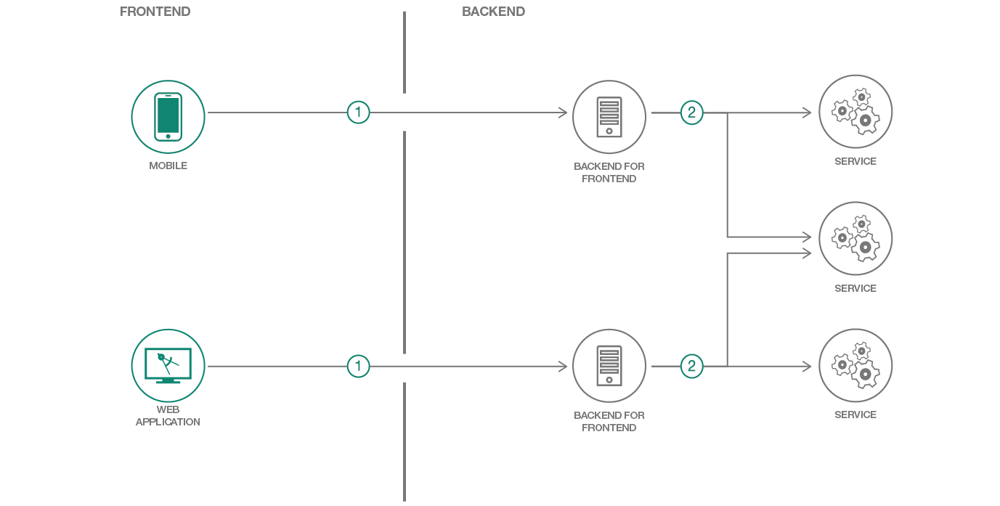

[](https://cloud.ibm.com)


# Create and deploy a Node.js Backend For Frontend (BFF) using Express

> We have similar patterns available for [Swift](https://github.com/IBM/swift-backend-for-frontend), [Java Spring](https://github.com/IBM/spring-backend-for-frontend), and [Java Liberty](https://github.com/IBM/java-liberty-backend-for-frontend) as well!

In this code pattern, you will create a Backend for Frontend (BFF) web service using [Express](https://expressjs.com/) in Node.js, matching a RESTful API documented in [Swagger](https://swagger.io/).

A BFF can be used to elegantly expose complex backend systems to multiple client-facing platforms, such as iOS and the web, without building a monolithic API that attempts to serve all clients equally. Different types of clients require different types of user experiences, and having a backend API tightly coupled to each specific user experience actually makes for a much more loosely coupled system overall. This pattern helps frontend teams iterate on features faster by giving them more control over the APIs they interact with, without affecting the user experience or development team driving a sister frontend.

When you have completed this code pattern, you will understand how to:

* Build out the Backend for Frontend (BFF) architecture pattern
* Deploy to Kubernetes, Cloud Foundry or a DevOps Pipeline
* Operate an application with monitoring and distributed trace
* Connect to provisioned services



## Video

Learn more about the Backend for Frontend pattern in this tech talk:

[](https://www.youtube.com/watch?v=B5OdK21ZevI)

## Steps

> As an alternative to the steps below, you can [create this project as a starter kit](https://cloud.ibm.com/developer/appservice/create-app?starterKit=98077554-b61f-3de0-90df-2fbd0bda5183) on IBM Cloud, which automatically provisions required services, and injects service credentials into a custom fork of this pattern. Then, you can skip directly to step 3 below.

1. [Install development tools](#1-install-development-tools)
1. [Configuration](#2-configuration)
1. [Run](#3-run)

## 1. Install development tools

### Local Development Tools Setup

- Install the latest [NodeJS](https://nodejs.org/en/download/) 6+ LTS version.

### IBM Cloud development tools setup

1. Install [IBM Cloud Developer Tools](https://cloud.ibm.com/docs/cli/index.html#overview) on your machine
2. Install the plugin with: `ibmcloud plugin install dev -r "IBM Cloud"`

## 2. Configuration

The project contains IBM Cloud specific files that are used to deploy the application as part of an IBM Cloud DevOps flow. The `.bluemix` directory contains files used to define the IBM Cloud toolchain and pipeline for your application. The `manifest.yml` file specifies the name of your application in IBM Cloud, the timeout value during deployment, and which services to bind to.

Service credentials are taken from the VCAP_SERVICES environment variable if running IBM Cloud Foundry, from individual environment variables per service if running on IBM Cloud Container Service (see `./server/config/mappings.json`), or from a config file if running locally, named `./server/config/localdev-config.js`.

## 3. Run

### Using IBM Cloud development CLI

The IBM Cloud development plugin makes it easy to compile and run your application if you do not have all of the tools installed on your computer yet. Your application will be compiled with Docker containers. To compile and run your app, run:

```bash
ibmcloud dev build
ibmcloud dev run
```

### Using your local development environment

#### Endpoints

Your application is running at: `http://localhost:3000/` in your browser.

- Your [Swagger UI](https://swagger.io/tools/swagger-ui/) is running on: `/explorer`
- Your Swagger definition is running on: `/swagger/api`
- Health endpoint: `/appmetrics-dash`

#### Session Store

You may see this warning when running `ibmcloud dev run`:
```
Warning: connect.session() MemoryStore is not
designed for a production environment, as it will leak
memory, and will not scale past a single process.
```
When deploying to production, it is best practice to configure sessions to be stored in an external persistence service.

## Troubleshooting

### Using IBM Cloud development CLI

To build and debug your app, run:

```bash
ibmcloud dev build --debug
ibmcloud dev debug
```

## License

This code pattern is licensed under the Apache License, Version 2. Separate third-party code objects invoked within this code pattern are licensed by their respective providers pursuant to their own separate licenses. Contributions are subject to the [Developer Certificate of Origin, Version 1.1](https://developercertificate.org/) and the [Apache License, Version 2](https://www.apache.org/licenses/LICENSE-2.0.txt).

[Apache License FAQ](https://www.apache.org/foundation/license-faq.html#WhatDoesItMEAN)
